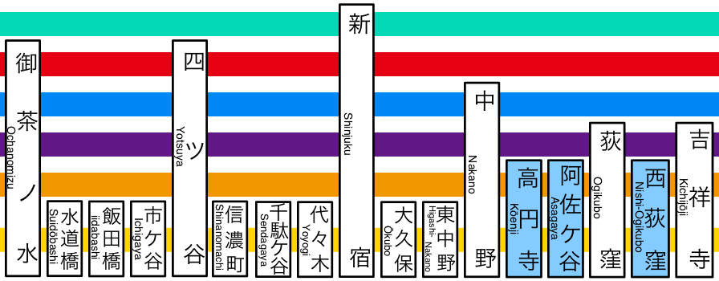

How does it work?
-----------------

See skiplist.h for documentation.

Good watching/reading material:

- http://stackoverflow.com/questions/256511/skip-list-vs-binary-tree
- http://www.youtube.com/watch?v=kBwUoWpeH_Q

Building
--------
$make

Todo
----

- Make lockfree variant using CAS
-
